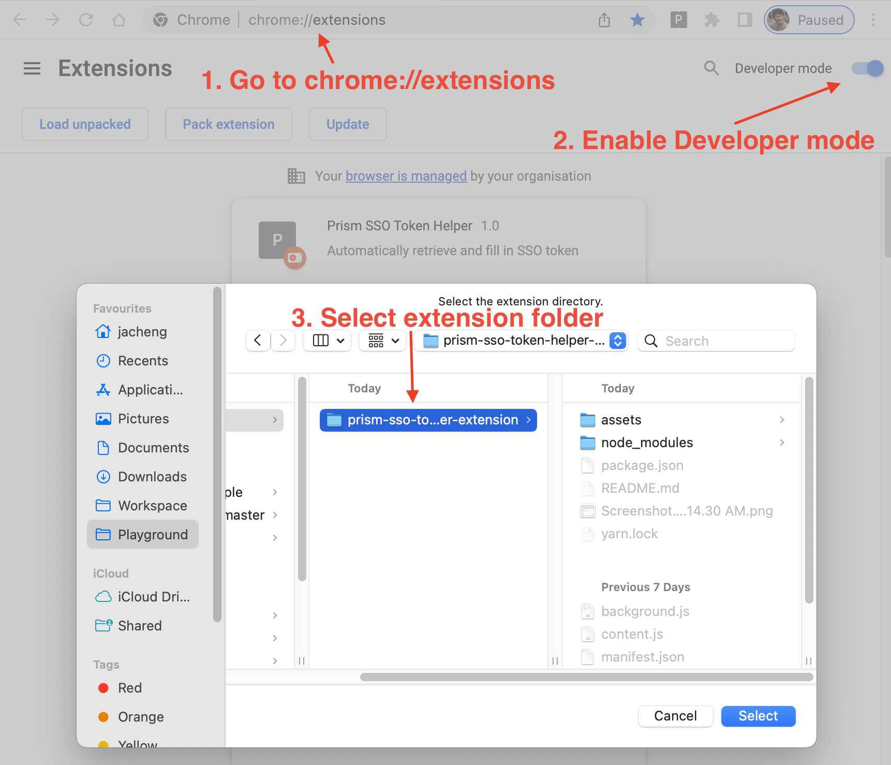
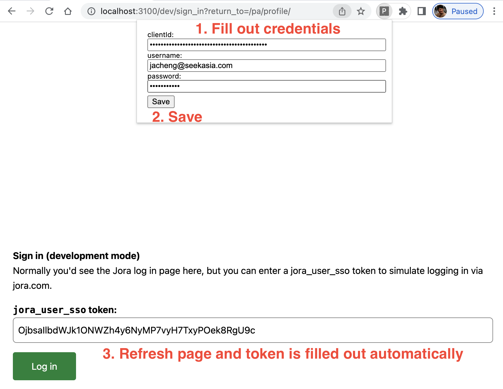

# Intro

A helper extension to automatically retrieve and fill in SSO token on Prism dev page.

# Installation on Chrome

# Usage

Hint:

- When copying and pasting credentials, please save individually as the popup will be dismissed when switching windows

# To change authentication url

Update the url in 2 places,

1. [background.js](src/background.js)
2. [manifest.json](manifest.json)
