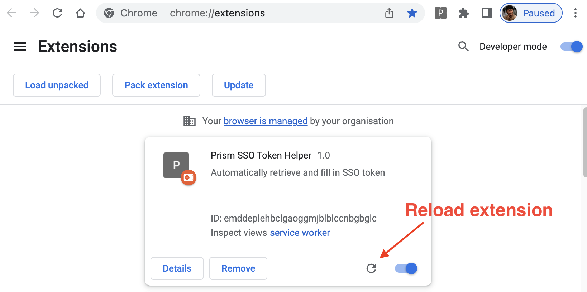

# Intro

A helper extension to automatically retrieve and fill in SSO token on Prism dev page.

# Installation on Chrome


# Usage


Hint:

- When copying and pasting credentials, please save individually as the popup will be dismissed when switching windows

# To whitelist a dev page url

1. Add a new entry at ```content_scripts.matches``` in [manifest.json](manifest.json)
2. Reload extension

# To change authentication url

1. Update the url in 2 places,

   1. [background.js](src/background.js)
   2. [manifest.json](manifest.json)
2. Reload extension

## How to reload extension?


